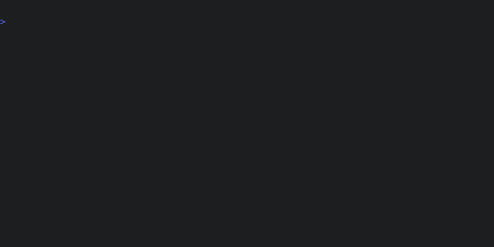

# Quick start

## Step 1: Configure a model

Tenx automatically configures default models based on API keys in the
environment. Refer to the [model config docs](config-models.md) to see which
models are configured for which key, and also how you can manually configure
models if needed. For our example, let's assume we're using Claude Sonnet from
Anthropic and set the corresponding environment variable:

```bash
export ANTHROPIC_API_KEY="my-api-key"
```

We can inspect the models that tenx has configured to make sure everything is
correct:


## Step 2: tenx quick

Now we have a model configured, let's write some code. Say we have a Rust
project with the following in `./src/lib.rs`:

```rust
{{#include examples/quickstart_before.rs}} 
```

First, we ask the model to implement the `fibonacci` function, using the
`quick` command:



The `quick` command is a shortcut which:

- Creates a new [session](./session.md) (`tenx new`)
- Adds `./src/lib.rs` to the session (`tenx add src/lib.rs`)    
- Issues a request to cut code (`tenx code`)

The `tenx code` command is one of Tenx's workhorse commands - it asks Tenx to
use the model to cut code within the current session. If the prompt isn't
otherwise provided, `code` opens an editor to get the user's input. 

After that, the pre [checks](config-checks.md) to ensure the project is in a
consistent state. This is important because it's how we validate the results of
the model's edits - if the edit results in a check failing, feedback is
provided back to the model and Tenx iterates until the checks pass (or we hit
our retry limit). Which checks run is based on the user's configuration, and
the file extensions of the files in the session. You can run the checks
manually like this:


In this case, our checks are `cargo check`, which does type and syntax
checking, and `cargo test` which runs the unit test suite. After the
pre-checks, we apply the model's changes to the code, and then run the
configured post-checks. These usually overlap with the pre-checks, but may be
different, depending on the configuration. In this case, our post-checks
include `cargo fmt` which also re-formats the code in-place.


## Step 3: tenx code

After our intial edit, we want to continue the session to make a tweak. First,
let's look at what the session currently contains:


We have one step in the session, with the changes we made above. Now, we will
use the `tenx code` command directly to add a unit test. The entire session
context will be passed back to the model, so we can just pick up where we left
off in the conversation.


And voila! We have a completed function and its attending unit tests. Here's
the final code:

```rust
{{#include examples/quickstart_after.rs}} 
```


