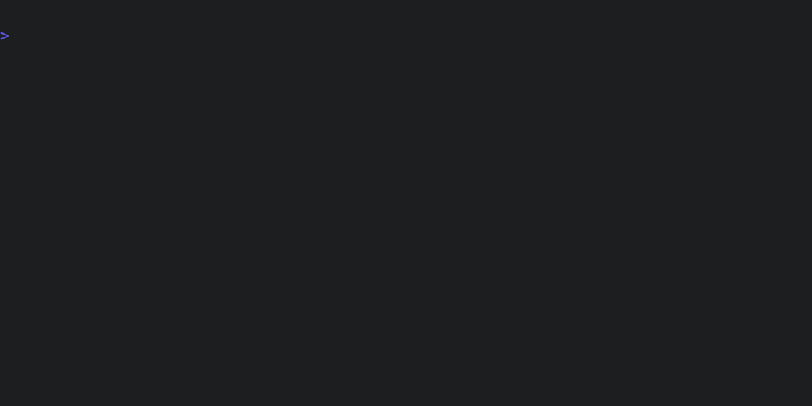

# Python Unit Tests

Unlike Rust, there's no consistent way to just run unit tests for a Python
project. Not only are there multiple test frameworks, but there are also a
morass of different ways to specify and manage dependencies. So while Tenx
includes support for linting and formatting Python with
[ruff](https://github.com/astral-sh/ruff), we "solve" the unit testing problem
by simply not including test support directly.

Luckily, configuring an [arbitrary check is very simple](./config-checks.md).
Here's an example of using [uv](https://github.com/astral-sh/uv) to run pytest
on all Python files in a project directory:

```ron
(
    checks: (
        custom: [
            (
                name: "pytest",
                command: "uv run pytest *.py",
                globs: ["**/*.py"],
            ),
        ]
    )
)
```

We can now verify that the **pytest** check is included in our project checks:


And we can run it on our project:


