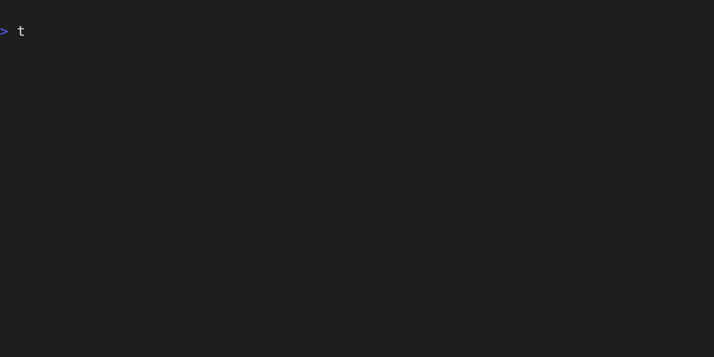

# Context: Rust

Let's look at using Tenx with [ruskel](https://github.com/cortesi/ruskel) to
provide library context for Rust. 

## Ruskel

Ruskel takes a Rust crate or module, and produces a skeleton of its public API,
using syntactically correct Rust, all in one file. If the crate or module is
not local, it will consult [crates.io](https://crates.io) to download the
source to produce the skeleton.

As an example, here's the output of the *ruskel* command line tool for the very
tiny [termsize](https://crates.io/crates/termsize) library.


Note that the module structure is preserved with rust **mod** statements, and
all structs, traits, functions in the public API are included along with their
docs, but the implementation is elided.

Now this is very useful as a quick, complete command-line reference to a
module, but it really shines when used to provide complete module context to a
model. Tenx's Ruskel integration means you can easily and quickly provide full
module documentation for **any** library on [crates.io](https://crates.io).

Another handy trick is to add a Ruskel context for local crates to your config.
Tenx itself does this to add **libtenx** by default, which means that we always
have an up to date snapshot of our API while working.


## Ruskel and Tenx

Let's do something a bit more meaty.
[Misanthropy](https://crates.io/crates/misanthropy) is a complete set of
bindings to the Anthropic API. It's a sister project of Tenx, as well as being
developed entirely using Tenx. The Ruskel output for Misanthropy is too long
to include here, but you can view it yourself with:

```bash
ruskel misanthropy
```

Our mission is to write a simple command line tool that uses Misanthropy to
make a call to the Anthropic API. First, let's define our starting point -
initially, we'll just have a simple placeholder command that prints "Hello
word!", like this:

```rust
{{#include examples/context_before.rs}} 
```

Now, we create a new session, and add the Misanthropy Ruskel skeleton to it.



Finally, we use the **tenx code** command to ask Tenx to write code within the
current session. For good measure, we'll also use GPT4o for this, rather than
the default Claude Sonnet.


And here's the result - the model has used the detailed API definition we
provided it to create a perfectly valid interaction with Anthropic.

```rust
{{#include examples/context_after.rs}} 
```

For good measure, here's the output of a run of the resulting program:

> {{#include examples/ruskel_run.txt}} 

