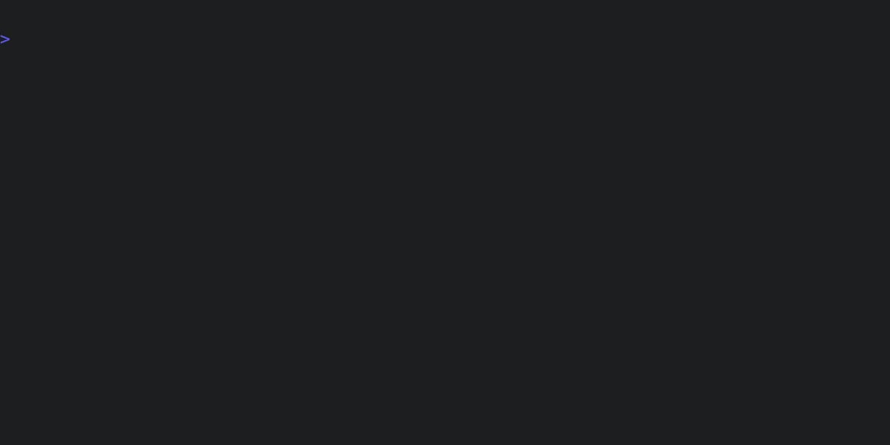

# Fixing code with tenx fix

Let's imagine we start with the following code:

```rust
{{#include examples/fix_before.rs}} 
```

The **fibonacci** function is unimplemented so the tests will immediately fail, as we can verify 
with the `tenx check` command:



We can now ask the model to make our checks pass with `tenx fix`. This runs the
checks on project, and sends any output from failing checks to the model. From
there, the model uses the **edit** capability of our dialect to read the needed
files to make changes. Here's what that looks like:


Note we didn't specify which files to edit (though we could have chosen to -
see `tenx help fix`). The output of the check here was sufficient for Sonnet to
be able to first ask to view the file, and then to make the edit itself.
